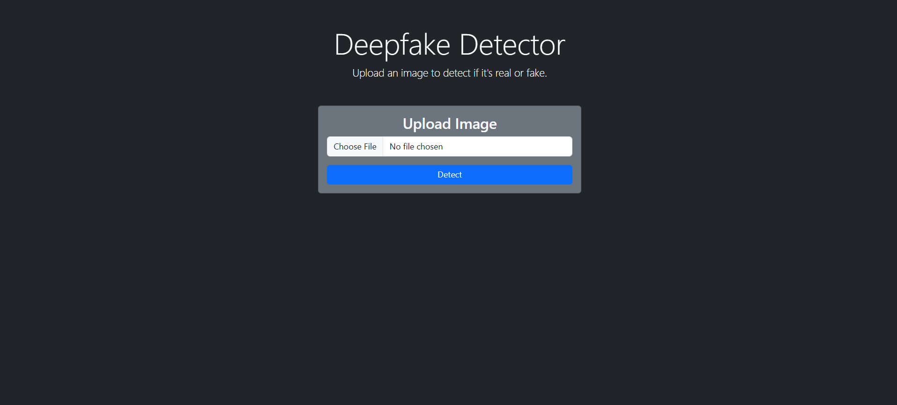
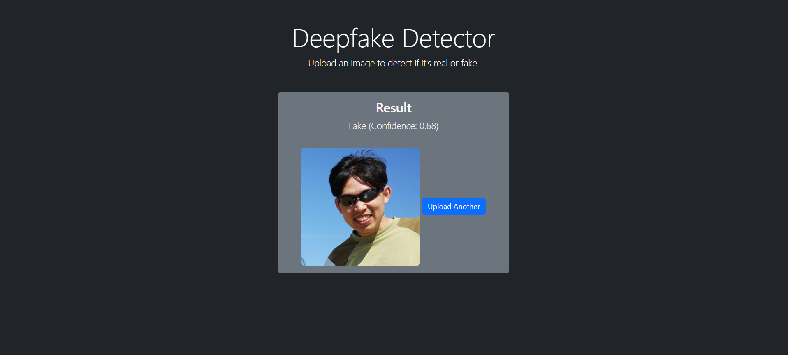

# 🌟 Deepfake Detector

Welcome to the **Deepfake Detector** project! This sleek and modern web application leverages deep learning to determine whether an uploaded image is **Real** or **Fake**. 🕵️‍♂️

---

## 🗂️ Project Structure

```
Deepfake Detector/
│
├── app.py               # Main Flask application file
├── deepfakeclassifier.h5  # Trained deep learning model
├── detection.ipynb      # Notebook for training and evaluation
├── static/              # Static files
│   └── css/
│       └── style.css    # CSS for styling
├── uploads/             # Directory for uploaded images
├── templates/           # HTML templates
│   ├── base.html        # Base HTML layout
│   ├── result.html      # Result display page
│   └── upload.html      # Image upload page
└── requirements.txt     # Python dependencies
```

---

## 🚀 Quick Start

### Step 1: Clone the Repository

```bash
$ git clone <repository-url>
$ cd <repository-directory>
```

### Step 2: Set Up a Virtual Environment

```bash
$ python -m venv venv
$ source venv/bin/activate  # On Windows: `venv\Scripts\activate`
```

### Step 3: Install Dependencies

```bash
$ pip install -r requirements.txt
```

### Step 4: Run the Application

Make sure the `deepfakeclassifier.h5` model file is in the project root.

```bash
$ python app.py
```

### Step 5: Open the App

Visit [http://127.0.0.1:5000/](http://127.0.0.1:5000/) in your browser.

---

## ✨ Features

- **Face Detection:** Automatically identifies faces in uploaded images.
- **Deepfake Classification:** Uses a trained CNN model to detect deepfakes.
- **Modern UI:** Stylish and intuitive interface for effortless interaction.
- **Real-Time Results:** Instant feedback on uploaded images.

---

## 🛠️ Technical Details

### Flask Application (`app.py`)

- **Model Loading:** Loads the trained model using TensorFlow's `load_model`.
- **Image Preprocessing:** Detects and resizes faces to match the model input size.
- **Result Rendering:** Displays predictions along with confidence scores.

### Training and Evaluation (`detection.ipynb`)

- **Model Architecture:** Built using Convolutional Neural Networks (CNN).
- **Metrics:** Evaluates accuracy and generates confusion matrices.
- **Visualization:** Provides detailed insights into model performance.

---

## 📂 Key Directories

- **`static/`**: Contains CSS for styling.
- **`templates/`**: HTML templates for consistent layouts.
- **`uploads/`**: Temporarily stores uploaded images.

---

## 📊 Dependencies

- **Flask**: For building the web application.
- **TensorFlow**: For loading the deep learning model.
- **OpenCV**: For face detection and image preprocessing.
- **NumPy**: For numerical operations.
- **Matplotlib & Seaborn**: For visualizations.
- **scikit-learn**: For evaluation metrics.

---

## 🎨 Preview

Here's a sneak peek of the app interface:

### Home Page



### Result Page



---

## 📜 License

This project is licensed under the **MIT License**. Feel free to use, modify, and distribute it as you like!

---

**💡 Ready to Detect the Fake? Let the truth shine through! 💡**
